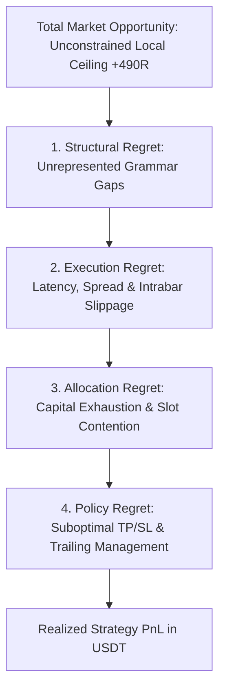

# Venue & Capital Simulation Specification v1.0

**Normative reference for real-world exchange execution, finite-capital portfolio dynamics, multidimensional authority, and monetary economic certification in V8.**

**Date:** 2026-08-19 · **Scope:** V8 / V8.2 compute core, economic plane, and Target Oracle systems · **Language:** Normative English matching V8 core specification and mathematical contracts.

---

## Document Status and Reading Rule

**Status: NORMATIVE SPECIFICATION / IMPLEMENTATION-READY / PRODUCTION ECONOMIC CONTRACT.**  
This specification is authoritative for all monetary, capital-constrained, and exchange-level simulation inside V8. It defines the formal bridge between strategy-normalized research coordinates ($R$-space) and account-level monetary performance ($\text{USDT}$-space). It establishes the rules under which economic claims may be computed, certified, or rejected.

This document inherits the V8 evidence and decision vocabulary:  
`LITERATURE_SUPPORTED`, `PROJECT_EVIDENCE_SUPPORTED`, `DESIGN_INFERENCE`, `PROVISIONAL_DECISION`, `LOCKED_INVARIANT`, `OPEN_QUESTION`, `REJECTED_OPTION`.

### Associated Formal Decisions
- **`D-028A`**: Declared price-distance risk unit ($R_{\text{price}}$) for research replay.
- **`D-028B`**: Capital-risk normalized multiple ($R_{\text{norm}}$) for realized monetary PnL.
- **`D-109`**: Formal decoupling of $R$-space diagnostics from $\text{USDT}$-space economics.
- **`D-110`**: Partition of the state space into four orthogonal structs (`MarketState`, `VenueState`, `AccountState`, `PortfolioState`).
- **`D-111`**: Binance USDⓈ-M as a versioned `VenueContract`, not a fourth Oracle role.
- **`D-112`**: Dual Hindsight Oracle architecture: Local Candidate Ceiling vs Capital-Constrained Portfolio Ceiling.
- **`D-113`**: Strict identifiability preconditions for the `EconomicCaptureRatio`.
- **`D-114`**: Multidimensional `ExecutionAuthorityProfile` superseding the 1D $L_1/L_2/L_3$ ladder.
- **`D-115`**: Bounded partial identification (`OutcomeBound`) for intrabar order ambiguity.
- **`D-116`**: Mandatory independent differential verification for economic certification.

---

## Abstract

V8 historical research operated primarily within a dimensionless, strategy-normalized coordinate system ($R$-multiples) evaluated on candidate episodes under an implicit infinite-capital and single-trade independence assumption. While mathematically convenient for isolating pure signal geometry, this abstraction creates a fundamental category error when applied to real-world capital: summing unconstrained trade-level $R$ scores does not compute realizable portfolio PnL. 

In a physical exchange environment—specifically crypto perpetual futures (Binance USDⓈ-M)—trading outcomes are strictly governed by stateful capital dynamics: finite wallet balances, margin requirements, leverage tier brackets, tick/lot size discretization, order queue priority, execution latency, non-linear market impact, fee schedules, mark-price liquidation thresholds, and concurrent position contention.

This specification formalizes the **V8 Economic Plane**. It establishes a 4-part state ontology, introduces versioned exchange rule contracts (`VenueContract<BinanceUsdM>`), implements capital allocation mechanics, replaces point-valued ambiguity with partial-identification intervals, and elevates the Hindsight Oracle to a path-dependent, capital-constrained Bellman dynamic programming formulation.

```mermaid
graph TD
    subgraph Research Plane [1. RESEARCH & DIAGNOSTIC PLANE (R-Space)]
        MD[Market Tape Data] --> MS[MarketState]
        MS --> EXP[Deterministic 28 Experts]
        EXP --> CAND[Candidate Hypotheses]
        CAND --> RSIM[Scalar Replay Kernel]
        RSIM --> OC[Outcome Cube & Unconstrained Local Hindsight: +490.82R]
    end

    subgraph Economic Plane [2. VENUE & CAPITAL SIMULATION PLANE (USDT-Space)]
        VS[VenueState: Binance USD-M Rules]
        AS[AccountState: 1,000 USDT Wallet / Margin]
        PS[PortfolioState: Positions / Collateral / Heat]
        
        CAND --> ALLOC[Risk Budget Allocator: 0.50% Equity]
        ALLOC -->|Discretization / Min Notional / Margin| ORDRQ[Legal Order Request]
        ORDRQ --> ESIM[USD-M Discrete-Event Simulator]
        VS --> ESIM
        AS --> ESIM
        PS --> ESIM
        
        ESIM -->|Fills / Funding / Liquidation| CASH[5-Component USDT Cashflow Ledger]
        CASH --> PSTATE[Next PortfolioState_t+1]
        CASH --> HIND2[Capital-Constrained Portfolio Hindsight: V*(S_t)]
    end
```

---

## 1. Literature Foundation & Theoretical Precedents

The design of this specification synthesizes key findings from quantitative finance, market microstructure, and econometric literature (2014–2026):

1. **Transaction Cost Analysis & Non-Linear Market Impact:**
   - *Almgren, R., & Chriss, N. (2000); Almgren, R. (2003)*: Optimal execution of portfolio transactions establishes that market impact decomposes into temporary and permanent components.
   - *Kyle, A. S., & Obizhaeva, A. A. (2016)*: Market microstructure invariance demonstrates that execution costs scale with trading velocity and order size relative to volume.
   - *Cont, R., Kukanov, I., & Stoikov, S. (2014); Cartea, Á., & Jaimungal, S. (2014)*: Order flow dynamics and queue depletion in limit order books show that static spread proxies significantly underestimate realized execution drag for aggressive orders.
   - *Recent findings (arXiv:2603.29086, 2026)*: Demonstrates that changing transaction cost and impact models alters not merely the PnL level, but the empirical ranking of quantitative trading algorithms.

2. **Stateful Portfolio Optimization & Capital Constraints:**
   - *Boyd, S., Busseti, E., et al. (2017)*: Multi-period trading via convex optimization proves that portfolio optimization under transaction costs, leverage limits, and holding constraints is inherently path-dependent and cannot be decomposed into independent single-period or single-trade evaluations.
   - *Gârleanu, N., & Pedersen, L. H. (2013)*: Dynamic trading with predictable returns and transaction costs confirms that optimal allocation depends directly on current holdings and available liquidity.
   - *Recent findings (arXiv:2003.01809)*: Reinforces dynamic programming formulations ($V^*(S_t)$) for portfolio selection under borrowing and collateral constraints.

3. **Perpetual Futures Microstructure, Funding & Liquidation:**
   - *Alexander, C., Choi, P., et al. (2020)*: The microstructure of cryptocurrency perpetual futures documents the mechanics of 8-hour funding rate cashflows and their impact on basis trading.
   - *He, S., Manela, A., et al. (2022); Angeris, G., et al. (2021)*: Mechanics of crypto derivatives demonstrate that mark-price dual-indexing (preventing manipulable last-price liquidations) and non-linear leverage brackets create asymmetric tail risk.
   - *Recent findings (arXiv:2102.04591)*: Analyzes Bitcoin futures liquidations, demonstrating that Gaussian approximations severely underestimate margin breach probabilities in high-volatility regimes.

4. **Partial Identification & Bounded Counterfactual Inference:**
   - *Manski, C. F. (2003)*: *Partial Identification of Probability Distributions*. In the absence of sub-bar intrabar path observations (e.g. knowing only OHLC extremes without sequence), point counterfactual outcomes are unidentifiable. The rigorous scientific response is to construct sharp bounding intervals ($[\text{Lower}, \text{Upper}]$), not to fabricate deterministic point claims.
   - *Imbens, G. W., & Manski, C. F. (2004)*: Confidence intervals for partially identified parameters.

5. **Multiple Testing, Snooping & Deflated Sharpe Ratios:**
   - *White, H. (2000); Hansen, P. R. (2005)*: The Reality Check and Superior Predictive Ability tests for data snooping.
   - *Bailey, D. H., & López de Prado, M. (2014)*: The Deflated Sharpe Ratio accounts for selection bias, non-normality, and trial volume.
   - *Harvey, C. R., & Liu, Y. (2015); Aronson, D. (2006)*: Document that searching over execution parameters (exit rules, fee models, sizing thresholds) is statistically equivalent to searching over alpha signals and must enter the multiple-testing multiplicity budget.

6. **Optimal Stopping & Dynamic Exit Boundaries:**
   - *Leung, T., & Li, X. (2015)*: *Optimal Mean Reversion Trading: Mathematical Analysis and Practical Applications*. Demonstrates that optimal liquidation boundaries with finite horizons are time-dependent; holding losing positions through structural stagnation generates exponential hazard rates of ruin.

---

## 2. Ontological Separation: Research $R$-Space vs Monetary $\text{USDT}$-Space

V8 enforces strict non-fungibility between strategy-normalized research coordinates and monetary account realities (`D-109`).

```text
┌─────────────────────────────────────────────────────────────────────────────┐
│                           CURRENCY & UNIT ALGEBRA                           │
├───────────────────────────────────┬─────────────────────────────────────────┤
│ Concept                           │ Formal Definition                       │
├───────────────────────────────────┼─────────────────────────────────────────┤
│ PriceRiskUnit (R_price)           │ ΔP_stop = |P_entry - P_stop|            │
│ RiskBudgetUSDT (B_USDT)           │ B_USDT = Equity_USDT × f_risk           │
│ RawQuantity (Q_raw)               │ Q_raw = B_USDT / ΔP_stop                │
│ DiscretizedQuantity (Q_eff)       │ Q_eff = ⌊Q_raw / stepSize⌋ × stepSize   │
│ EffectiveInitialRiskUSDT (R_eff)  │ R_eff = Q_eff × ΔP_stop                 │
│ RealizedCashflow (PnL_USDT)       │ ΔWallet = GrossPnL - Fee ± Fund - Slip  │
│ NormalizedR (R_norm)              │ R_norm = PnL_USDT / R_eff               │
└───────────────────────────────────┴─────────────────────────────────────────┘
```

### 2.1 The Category Error of Summing Unconstrained $R$
In research replay, $N$ candidate trades generate outcomes $r_1, r_2, \dots, r_N \in \mathbb{R}$. Traditional systems compute:
\[
R_{\text{total}} = \sum_{i=1}^N r_i
\]
**Theorem 2.1 (Monetary Invalidity of Unconstrained $R$ Sums):**  
Let $E_t$ be portfolio equity at time $t$. If trades $i$ and $j$ overlap in time ($[t_{\text{entry}, i}, t_{\text{exit}, i}] \cap [t_{\text{entry}, j}, t_{\text{exit}, j}] \neq \emptyset$), the capital available to trade $j$ is a function of the portfolio state after trade $i$'s allocation and margin lock. Therefore:
\[
\text{PnL}_{\text{portfolio}}([0, T]) \neq \sum_{i=1}^N \left( E_0 \cdot f_{\text{risk}} \cdot r_i \right)
\]
Summing independent $R$ scores assumes:
1. Infinite collateral (no margin exhaustion).
2. Infinite concurrency capacity (no exposure slot rejections).
3. Zero feedback between trade outcomes and subsequent position sizing.
4. Scale-invariant friction (0.07R fee regardless of lot size discretization).

**Invariant 2.1 (`D-109`):**  
$R$-space metrics ($E[R]$, $\sum R$, Sharpe in $R$) are strictly analytical diagnostic indicators for hypothesis comparison. No monetary claim (`PROFITABLE`, `SUPPORTED_EDGE`) may be emitted without passing the stateful $\text{USDT}$-space portfolio simulation.

---

## 3. The 4-Part State Ontology (`D-110`)

At every decision epoch $t$, the full state $S_t$ is partitioned into four decoupled, immutable representations:

\[
S_t = \langle M_t, V_t, A_t, P_t \rangle
\]

```rust
pub struct DecisionState {
    pub market: MarketState,       // M_t: Exogenous physical market facts
    pub venue: VenueState,         // V_t: Versioned exchange rules and filters
    pub account: AccountState,     // A_t: Participant balance, margin & fee tier
    pub portfolio: PortfolioState, // P_t: Active positions, orders & risk heat
}
```

### 3.1 `MarketState(t)` (Exogenous Market Layer)
Contains point-in-time market observations independent of any participant:
- OHLCV price series for all declared symbols and intervals.
- Cumulative volume and trade count streams.
- Historical 8-hour funding rates and next settlement timestamps.
- Point-in-time derived technical features (EMA, ADX, ATR, RSI, MACD).
- 4D Market Regime classification tags (Trend, Volatility, Volume, Funding).

### 3.2 `VenueState(t)` (Exchange Contract Layer)
Encapsulates versioned exchange rules (`VenueContract`):
- `price_filter`: `minPrice`, `maxPrice`, `tickSize`.
- `lot_size`: `minQty`, `maxQty`, `stepSize`.
- `market_lot_size`: Maximum aggressive market order quantity.
- `min_notional`: Minimum order nominal value in USDT (e.g. 5.0 USDT).
- `leverage_brackets`: Max allowed leverage per notional tier.
- `mark_price`: Current dual-index mark price for liquidation checks.
- `fee_schedule`: Maker and Taker fee rates for the current tier.

### 3.3 `AccountState(t)` (Account Financial Layer)
Represents the participant's balance sheet:
- `wallet_balance_usdt`: Cash balance settled in USDT.
- `unrealized_pnl_usdt`: Floating mark-to-market PnL across active positions.
- `equity_usdt`: Total equity ($E_t = \text{Wallet} + \text{UnrealizedPnL}$).
- `initial_margin_usdt`: Collateral locked in open positions.
- `available_balance_usdt`: Capital available for new orders ($E_t - \text{InitialMargin}$).
- `margin_mode`: Cross Margin or Isolated Margin.
- `fee_tier`: VIP level (VIP0 to VIP9) and BNB fee discount status.

### 3.4 `PortfolioState(t)` (Exposure & Allocation Layer)
Tracks active commitments:
- `positions`: Map of active open positions by symbol and direction.
- `open_orders`: Contingent stop-loss, take-profit, and limit orders.
- `maintenance_margin_usdt`: Required margin to avoid liquidation.
- `portfolio_heat_r`: Sum of current open stop-loss dollar risks divided by equity.
- `concurrency_count`: Number of simultaneously active exposure slots.

---

## 4. Binance USDⓈ-M Venue Contract Formalization (`D-111`)

Binance USDⓈ-M mechanics are implemented with byte-exact precision matching Binance developer specifications.

### 4.1 Order Filter Discretization Operators

For an intended price $P$ and quantity $Q$:

1. **Price Tick Discretization:**
   \[
   \mathcal{D}_{\text{price}}(P, \text{tickSize}) = \lfloor P / \text{tickSize} \rfloor \times \text{tickSize}
   \]
2. **Quantity Step Discretization:**
   \[
   \mathcal{D}_{\text{qty}}(Q, \text{stepSize}) = \lfloor Q / \text{stepSize} \rfloor \times \text{stepSize}
   \]
3. **Minimum Notional Constraint:**
   \[
   \text{Notional}(P, Q) = P \times Q \ge \text{MIN\_NOTIONAL} \quad (5.0\text{ USDT})
   \]
   If $\text{Notional} < 5.0\text{ USDT}$, the order fails closed with `MIN_NOTIONAL_REJECTED`.

### 4.2 Leverage Brackets and Initial Margin

Leverage is modeled strictly as a **capital and margin constraint**, not a strategy edge multiplier (`D-111`). Binance USDⓈ-M defines tiered leverage brackets:

| Tier ($k$) | Notional Cap ($N_k$) | Max Leverage ($L_k$) | Maintenance Margin Rate ($MMR_k$) | Maintenance Amount Offset ($\text{cum}_k$) |
| :---: | :---: | :---: | :---: | :---: |
| 1 | 50,000 USDT | 125x | 0.40% | 0.00 USDT |
| 2 | 250,000 USDT | 100x | 0.50% | 50.00 USDT |
| 3 | 1,000,000 USDT | 50x | 1.00% | 1,300.00 USDT |
| 4 | 5,000,000 USDT | 20x | 2.50% | 16,300.00 USDT |

For an assigned leverage $L \le L_k$:
\[
\text{InitialMargin} = \frac{\text{Notional}}{L}
\]
\[
\text{MaintenanceMargin} = \text{Notional} \times MMR_k - \text{cum}_k
\]

### 4.3 Exact Liquidation Price Formulation

In Isolated Margin mode:
- **Long Position Liquidation Price:**
  \[
  P_{\text{liq}}^{\text{LONG}} = \frac{P_{\text{entry}} \times Q - \text{IsolatedMargin} + \text{cum}_k}{Q \times (1 - MMR_k)}
  \]
- **Short Position Liquidation Price:**
  \[
  P_{\text{liq}}^{\text{SHORT}} = \frac{P_{\text{entry}} \times Q + \text{IsolatedMargin} - \text{cum}_k}{Q \times (1 + MMR_k)}
  \]

**Invariant 4.1 (Mark Price Dual-Indexing):**  
Liquidation events are triggered **strictly when Mark Price touches $P_{\text{liq}}$**, not Last Contract Price. Stop-loss triggers may be configured on either Mark Price or Last Price, matching Binance order parameterization.

---

## 5. Execution Microstructure & Bounded Partial Identification (`D-114`, `D-115`)

### 5.1 Multidimensional Execution Authority Profile (`D-114`)
The legacy 1D $L_1/L_2/L_3$ ladder is replaced by an orthogonal 6-axis execution profile:

```rust
pub struct ExecutionAuthorityProfile {
    pub market_path: MarketPathFidelity,       // Bar | SubBar1m | AggTrades | L2OrderBook
    pub venue_rules: VenueRuleFidelity,         // Generic | BinanceUsdM_Versioned
    pub fill_authority: FillAuthority,          // Canonical | AggressiveObserved | PassiveModelled | Live
    pub impact_authority: ImpactAuthority,      // None | ExogenousPowerLaw | CalibratedReactive
    pub account_authority: AccountAuthority,    // Unconstrained | CapitalConstrained | LiveShadow
    pub identifiability: IdentifiabilityStatus, // Identified | PartialInterval | ModelDerived | Unknown
}
```

### 5.2 Intrabar Ambiguity & Manski Partial Identification Bounds (`D-115`)
When an evaluation bar exhibits:
\[
\text{High} \ge P_{\text{target}} \quad \text{AND} \quad \text{Low} \le P_{\text{stop}}
\]
and sub-bar tick data is unavailable, the outcome is partially identified.

```text
┌─────────────────────────────────────────────────────────────────────────────┐
│                    PARTIAL IDENTIFICATION OUTCOME BOUND                     │
├─────────────────────────────────────────────────────────────────────────────┤
│  Lower Bound (Worst-Case STOP_FIRST):                                       │
│      PnL_lower = -Stop_USDT - Fees                                          │
│                                                                             │
│  Upper Bound (Best-Case TARGET_FIRST):                                      │
│      PnL_upper = +Target_USDT - Fees                                        │
│                                                                             │
│  Probabilistic Expectation (Driftless Brownian Bridge):                     │
│      P(Low before High) = (High - Open) / (High - Low)                      │
│      E[PnL] = P(Target) × PnL_upper + P(Stop) × PnL_lower                   │
└─────────────────────────────────────────────────────────────────────────────┘
```

**Invariant 5.1 (`D-115`):**  
The authoritative ledger records the bounding interval $\mathcal{B} = [\text{PnL}_{\text{lower}}, \text{PnL}_{\text{upper}}]$. Any comparative ranking between policies whose bounds overlap is marked `RANKING_INCONCLUSIVE_UNDER_AMBIGUITY`.

---

## 6. Sizing, Capital Constraints & Failure Modes

### 6.1 Fractional Kelly Allocation Engine
To prevent risk-of-ruin under parameter uncertainty, position sizing follows fractional Kelly with volatility scaling:
\[
f^* = \frac{p \cdot b - q}{b} \quad \text{where } b = \frac{\overline{\text{Win}}_{\text{USDT}}}{\overline{\text{Loss}}_{\text{USDT}}}, \quad q = 1 - p
\]
\[
f_{\text{allocated}} = \min\left( \frac{1}{4} f^*, \, f_{\max} \right) \quad (f_{\max} = 0.01 \text{ [1% equity]})
\]
\[
B_{\text{USDT}} = E_t \times f_{\text{allocated}}
\]

### 6.2 Typed Allocation Rejection Taxonomy

When an Expert emits a Candidate Draft, the `RiskBudgetAllocator` subjects it to mandatory physical admission checks:

| Rejection Code | Trigger Condition | Epistemic Meaning |
| :--- | :--- | :--- |
| `INSUFFICIENT_AVAILABLE_BALANCE` | $\text{InitialMargin} > \text{AvailableBalance}$ | Collateral fully deployed |
| `MIN_NOTIONAL_REJECTED` | $Q_{\text{eff}} \times P_{\text{entry}} < 5.0\text{ USDT}$ | Order too small for venue |
| `QUANTITY_ROUNDS_TO_ZERO` | $Q_{\text{raw}} < \text{stepSize} / 2$ | Risk budget below 1 lot step |
| `MARGIN_LIMIT_EXCEEDED` | $\text{GrossNotional} > \text{TierMaxNotional}$ | Breaches maximum leverage tier |
| `LEVERAGE_CONSTRAINT` | Required leverage exceeds policy cap | Risk policy restriction |
| `PORTFOLIO_HEAT_EXCEEDED` | $\sum \text{Risk}_{\text{USDT}} / E_t > \text{MaxHeat}$ | Total drawdown exposure cap |
| `CAPITAL_CONSTRAINT_REJECTION` | All exposure slots occupied | Concurrency saturation |

---

## 7. 5-Component Cashflow Ledger

Every execution lifecycle emits an immutable record to `economic-cashflow.jsonl`:

```rust
pub struct EconomicCashflow {
    pub event_time: i64,
    pub candidate_id: String,
    pub symbol: String,
    pub direction: String,
    pub quantity: f64,
    pub entry_price: f64,
    pub exit_price: f64,
    pub gross_market_pnl_usdt: f64,
    pub commission_usdt: f64,
    pub funding_cashflow_usdt: f64,
    pub slippage_usdt: f64,
    pub gap_through_stop_usdt: f64,
    pub net_pnl_usdt: f64,
    pub wallet_balance_before: f64,
    pub wallet_balance_after: f64,
    pub margin_usage_pct: f64,
}
```

### 7.1 Cashflow Conservation Equation
\[
\text{Wallet}_{t+1} = \text{Wallet}_t + \text{GrossMarketPnL} - \text{Commission} + \text{FundingCashflow} - \text{Slippage} - \text{GapPenalty}
\]
Every term is recorded in nominal account currency ($\text{USDT}$) and cross-verified by single-writer checksums.

---

## 8. Dual Hindsight Oracle Architecture & Bellman Dynamic Programming (`D-112`)

V8 formally establishes two distinct Hindsight Ceilings:

```text
┌─────────────────────────────────────────────────────────────────────────────┐
│ 1. UNCONSTRAINED LOCAL HINDSIGHT CEILING (Diagnostic Frame / R-Space)       │
├─────────────────────────────────────────────────────────────────────────────┤
│  - Evaluates each Candidate episode independently                           │
│  - Assumes infinite capital and zero opportunity contention                 │
│  - Metric: +490.82R (Theoretical upper bound on signal quality)              │
│  - Evidentiary Status: NO_ECONOMIC_CLAIM (Research diagnostic tool)         │
└─────────────────────────────────────────────────────────────────────────────┘
                                      │
                                      ▼
┌─────────────────────────────────────────────────────────────────────────────┐
│ 2. CAPITAL-CONSTRAINED PORTFOLIO HINDSIGHT CEILING (Economic Frame / USDT)  │
├─────────────────────────────────────────────────────────────────────────────┤
│  - Evaluates sequence over finite wallet balance (e.g. 1,000 USDT)          │
│  - Strict Binance USDⓈ-M rules, margin brackets, and concurrency limits     │
│  - Bellman Dynamic Programming Formulation: V*(S_t)                         │
│  - Metric: Maximum legally reachable terminal equity (e.g. +147.32 USDT)    │
│  - Evidentiary Status: AUTHORITATIVE ECONOMIC BENCHMARK                     │
└─────────────────────────────────────────────────────────────────────────────┘
```

### 8.1 Bellman Dynamic Programming Formulation for Portfolio Hindsight

Let $S_t = \langle M_t, V_t, A_t, P_t \rangle$ be the complete decision state at bar $t$. The Capital-Constrained Portfolio Hindsight Oracle solves:

\[
V^*(S_t) = \max_{A_t \in \mathcal{A}_{\text{legal}}(S_t)} \left\{ \text{Cashflow}(S_t, A_t) + V^*(S_{t+1}) \right\}
\]
subject to:
\[
A_t \in \mathcal{A}_{\text{legal}}(S_t) \iff \begin{cases}
\text{InitialMargin}(A_t) \le \text{AvailableBalance}(A_t) \\
\text{Notional}(A_t) \ge \text{MIN\_NOTIONAL} \\
\text{Positions}(P_t \oplus A_t) \le \text{MaxConcurrency} \\
\text{Heat}(P_t \oplus A_t) \le \text{MaxHeat}
\end{cases}
\]

---

## 9. 4-Part Regret Attribution Taxonomy

The total performance gap between the theoretical market opportunity and realized portfolio performance decomposes into four orthogonal regret components:

\[
\text{TotalRegretGap} = \text{StructuralRegret} + \text{ExecutionRegret} + \text{AllocationRegret} + \text{PolicyRegret}
\]



1. **`StructuralRegret` ($\mathcal{R}_{\text{struct}}$):**  
   Opportunities present in the market tape that the 28 Expert grammar templates failed to propose.
2. **`ExecutionRegret` ($\mathcal{R}_{\text{exec}}$):**  
   Value lost due to execution delays, entry spread, taker fees, and adverse bar-gap slippage.
3. **`AllocationRegret` ($\mathcal{R}_{\text{alloc}}$):**  
   Value lost when valid concurrent opportunities occurred simultaneously, but finite account margin or concurrency caps selected a suboptimal subset.
4. **`PolicyRegret` ($\mathcal{R}_{\text{policy}}$):**  
   Value lost due to decision-time policy choices: premature static take-profit clipping, tight stop-outs during noise, or stagnation holding decay.

---

## 10. Economic Identifiability & Certification Gate (`D-113`, `D-116`)

### 10.1 Economic Capture Ratio Preconditions (`D-113`)
The `EconomicCaptureRatio` is defined as:
\[
\text{CaptureRatio} = \frac{\text{RealizedPortfolioNetPnL}_{\text{USDT}}}{\text{CapitalConstrainedPortfolioHindsight}_{\text{USDT}}}
\]
**Theorem 10.1 (Identifiability Condition):**  
The `CaptureRatio` is mathematically identifiable **if and only if**:
\[
\text{hash}(\text{Population}_{\text{actual}}) = \text{hash}(\text{Population}_{\text{oracle}})
\]
\[
\text{hash}(\text{VenueContract}_{\text{actual}}) = \text{hash}(\text{VenueContract}_{\text{oracle}})
\]
\[
\text{hash}(\text{CapitalContract}_{\text{actual}}) = \text{hash}(\text{CapitalContract}_{\text{oracle}})
\]
If any contract hash diverges, the runtime must emit `CAPTURE_RATIO_NOT_IDENTIFIABLE`.

### 10.2 Independent Reference Simulator Verification (`D-116`)
Before any economic claim is certified, the Rust simulator's cashflow ledger (`economic-cashflow.jsonl`) must undergo automated differential reconciliation against an independent reference engine.

Every trade is checked for:
1. Exact quantity rounding match ($|\Delta Q| = 0$).
2. Exact fee deduction match ($|\Delta \text{Fee}| < 10^{-6}\text{ USDT}$).
3. Exact funding settlement match ($|\Delta \text{Funding}| < 10^{-6}\text{ USDT}$).
4. Exact terminal wallet balance match ($|\Delta \text{Wallet}| < 10^{-4}\text{ USDT}$).

---

## 11. Monograph Governance & Reading Guide

This specification is integrated into the V8 monograph corpus:
- Embedded in `site/index.html` via `tools/build_monograph.py`.
- Governed by formal decisions `D-109` through `D-116` in `docs/decisions/DECISION_REGISTER.md`.
- Implemented in the pure Rust compute core under `v8-core/src/quant.rs` and `v8-core/src/simulator.rs`.

**End of Specification.**
