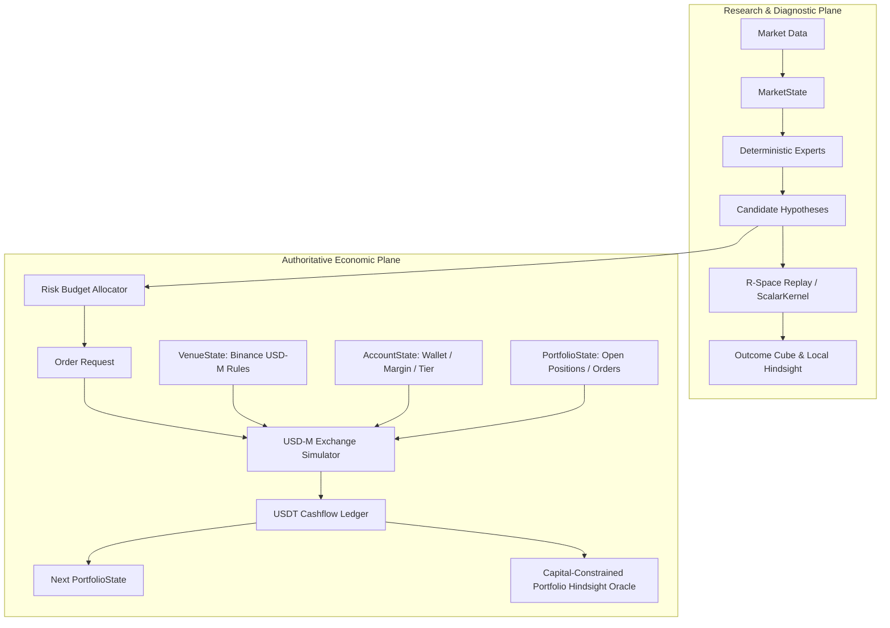

# Venue & Capital Simulation Specification v1.0

**Owning contract:** `VENUE_AND_CAPITAL_SIMULATION_SPEC.md`  
**Status:** LOCKED SPECIFICATION  
**Decisions:** D-028A, D-028B, D-109, D-110, D-111, D-112, D-113, D-114, D-115, D-116  

---

## 1. Ontological Separation: R-Space Diagnostics vs USDT-Space Economics

V8 strictly decouples strategy-normalized research coordinates ($R$-space) from monetary capital realities ($\text{USDT}$-space). They are non-fungible quantities governed by distinct authority levels (D-109).



### 1.1 Formal Currency and Unit Definitions

1. **`PriceRiskUnit` ($R_{\text{price}}$)**: The price distance between entry price and the initial stop loss level ($\Delta P_{\text{stop}} = |P_{\text{entry}} - P_{\text{stop}}|$).
2. **`RiskBudgetUSDT` ($B_{\text{USDT}}$)**: The nominal dollar risk allocated to an episode from current portfolio equity:
   \[
   B_{\text{USDT}} = \text{Equity}_{\text{USDT}} \times f_{\text{risk}}
   \]
3. **`RawQuantity` ($Q_{\text{raw}}$)**: The unconstrained contract quantity before exchange step-size discretization:
   \[
   Q_{\text{raw}} = \frac{B_{\text{USDT}}}{\Delta P_{\text{stop}}}
   \]
4. **`EffectiveInitialRiskUSDT` ($R_{\text{effective}}$)**: The exact physical dollar risk after `LOT_SIZE` rounding and minimum notional checks:
   \[
   R_{\text{effective}} = Q_{\text{discretized}} \times \Delta P_{\text{stop}}
   \]
5. **`PnLUSDT` ($\text{PnL}_{\text{USDT}}$)**: The net realized cash balance delta in account currency, accounting for execution prices, tiered trading fees, slippage, and cumulative funding cashflows.
6. **`NormalizedR` ($R_{\text{norm}}$)**: The capital-risk multiple realized by the portfolio:
   \[
   R_{\text{norm}} = \frac{\text{PnL}_{\text{USDT}}}{R_{\text{effective}}}
   \]

---

## 2. The 4-Part State Ontology (D-110)

The system rejects conflating market state with account or exchange state. The runtime state at decision time $t$ is partitioned into four orthogonal, immutable structs:

```rust
pub struct DecisionState {
    pub market: MarketState,
    pub venue: VenueState,
    pub account: AccountState,
    pub portfolio: PortfolioState,
}
```

1. **`MarketState(t)`**: Point-in-Time prices, returns, order flow metrics, rolling volatility (ATR), and technical feature arrays. Exogenous to the participant.
2. **`VenueState(t)`**: Versioned exchange rules (`VenueContract`), tick size, lot step size, minimum notional constraints, mark price streams, and leverage brackets.
3. **`AccountState(t)`**: Wallet balance ($\text{USDT}$), available margin balance, total equity, margin mode (Cross/Isolated), and tiered maker/taker fee rates.
4. **`PortfolioState(t)`**: Active positions, open conditional orders, initial margin allocated, maintenance margin requirement, unrealized PnL, and portfolio heat.

---

## 3. Versioned VenueContract: Binance USDⓈ-M (D-111)

Binance USDⓈ-M is formalized as an `Environment/VenueContract`, not a distinct Oracle role.

```rust
pub struct VenueContract {
    pub venue_id: String,                  // "BINANCE_USDM"
    pub instrument: String,                // "BTCUSDT"
    pub contract_type: ContractType,       // PERPETUAL
    pub price_filter: PriceFilter,         // minPrice, maxPrice, tickSize
    pub lot_size: LotSizeFilter,           // minQty, maxQty, stepSize
    pub min_notional: f64,                 // 5.0 USDT
    pub fee_model: FeeModel,               // Tiered Maker/Taker BPS
    pub funding_interval_hours: i64,       // 8 hours
    pub leverage_brackets: Vec<Bracket>,   // Max leverage per notional tier
    pub liquidation_model: LiquidationModel,// Maintenance margin rate schedule
}
```

### 3.1 Leverage as a Margin Constraint, Not an Edge Multiplier
Leverage does not multiply strategy expectancy; it defines the capital/margin feasibility boundary:
\[
\text{InitialMarginRequired} = \frac{\text{Notional}}{\text{Leverage}} = \frac{Q \times P_{\text{entry}}}{\text{Leverage}}
\]
If $\text{InitialMarginRequired} > \text{AvailableBalance}_{\text{USDT}}$, the trade is rejected with `INSUFFICIENT_AVAILABLE_BALANCE`.

---

## 4. Finite Capital Allocation & Rejection Reasons

When candidates fire, the mandatory `RiskBudgetAllocator` filters candidates through physical exchange legality:

```text
Candidate Setup
       │
       ▼
Risk Budget Calculation (Equity × RiskFraction)
       │
       ▼
Quantity Derivation (Budget / StopDistance)
       │
       ▼
LOT_SIZE Discretization (stepSize) ──> [If Q == 0] ──> QUANTITY_ROUNDS_TO_ZERO
       │
       ▼
MIN_NOTIONAL Check (Q × P >= $5) ────> [If Notional < $5] ──> MIN_NOTIONAL_REJECTED
       │
       ▼
Margin & Leverage Bracket Check ────> [If Margin > Avail] ─> INSUFFICIENT_AVAILABLE_BALANCE
       │
       ▼
Slot / Concurrency Limit Check ──────> [If Slots Full] ────> CAPITAL_CONSTRAINT_REJECTION
       │
       ▼
Legal Execution Order Dispatched
```

---

## 5. 5-Component Cashflow Ledger

Every trade records an immutable, cashflow-level ledger in account currency:

```rust
pub struct EconomicCashflow {
    pub event_time: i64,
    pub candidate_id: String,
    pub realized_market_pnl_usdt: f64,
    pub commission_usdt: f64,
    pub funding_cashflow_usdt: f64,
    pub slippage_usdt: f64,
    pub gap_through_stop_usdt: f64,
    pub net_pnl_usdt: f64,
    pub wallet_balance_before: f64,
    pub wallet_balance_after: f64,
}
```

\[
\text{NetPnL}_{\text{USDT}} = \text{RealizedMarketPnL} - \text{Commission} \pm \text{FundingCashflow} - \text{Slippage} - \text{GapPenalty}
\]

---

## 6. Dual Hindsight Oracle Architecture (D-112)

V8 establishes two formally separated Hindsight Ceilings:

```text
┌─────────────────────────────────────────────────────────────────────────────┐
│ 1. UNCONSTRAINED LOCAL HINDSIGHT CEILING (Diagnostic / R-Space)             │
│    - Infinite capital assumption                                             │
│    - Evaluates every Candidate episode independently                         │
│    - Metric: +490.82R (Theoretical opportunity ceiling)                      │
│    - Status: NO_ECONOMIC_CLAIM (Research diagnostic tool)                    │
└─────────────────────────────────────────────────────────────────────────────┘
                                      │
                                      ▼
┌─────────────────────────────────────────────────────────────────────────────┐
│ 2. CAPITAL-CONSTRAINED PORTFOLIO HINDSIGHT CEILING (Economic / USDT-Space)   │
│    - Finite wallet balance (e.g. 1,000 USDT initial equity)                  │
│    - Strict Binance USDⓈ-M rules, margin brackets, and concurrency limits    │
│    - Dynamic Programming Path: V*(Market, Account, Portfolio, Venue)         │
│    - Metric: Maximum legal realizable terminal equity (e.g. +147.32 USDT)    │
│    - Status: AUTHORITATIVE ECONOMIC BENCHMARK                                │
└─────────────────────────────────────────────────────────────────────────────┘
```

---

## 7. 4-Part Regret Attribution Taxonomy

The system decomposes the delta between the theoretical market opportunity and realized performance into four mutually exclusive regret categories:

1. **`StructuralRegret`**: Opportunities existing in market data that the Expert grammar/feature plane failed to represent.
2. **`ExecutionRegret`**: Lost value due to execution delays, entry spread, slippage, and adverse intrabar fill paths.
3. **`AllocationRegret`**: Lost value when competing valid setups occurred simultaneously and finite margin selected a suboptimal candidate.
4. **`PolicyRegret`**: Lost value resulting from suboptimal exit timing, premature stop-outs, or trailing parameter decay.

---

## 8. Multidimensional Execution Authority Profile (D-114)

The one-dimensional $L_1/L_2/L_3$ ladder is upgraded to an orthogonal `ExecutionAuthorityProfile`:

```rust
pub struct ExecutionAuthorityProfile {
    pub market_path: MarketPathFidelity,       // Bar | SubBar1m | AggTrades | L2OrderBook
    pub venue_rules: VenueRuleFidelity,         // Generic | BinanceUsdM_Versioned
    pub fill_authority: FillAuthority,          // Canonical | AggressiveObserved | PassiveModelled | Live
    pub impact_authority: ImpactAuthority,      // None | ExogenousBps | CalibratedReactive
    pub account_authority: AccountAuthority,    // Unconstrained | CapitalConstrained | LiveShadow
    pub identifiability: IdentifiabilityStatus, // Identified | PartialInterval | ModelDerived | Unknown
}
```

---

## 9. Monograph & Contract Invariants

- **`D-113`**: `EconomicCaptureRatio` may only be computed when `population_hash`, `venue_contract_hash`, `capital_contract_hash`, `cost_model_hash`, and `execution_authority_hash` are identical across numerator and denominator. Otherwise, the metric is marked `CAPTURE_RATIO_NOT_IDENTIFIABLE`.
- **`D-115`**: Same-bar stop/target ambiguity without tick path resolution emits a partial-identification interval (`OutcomeBound [Lower, Upper]`), never a false point-valued claim.
