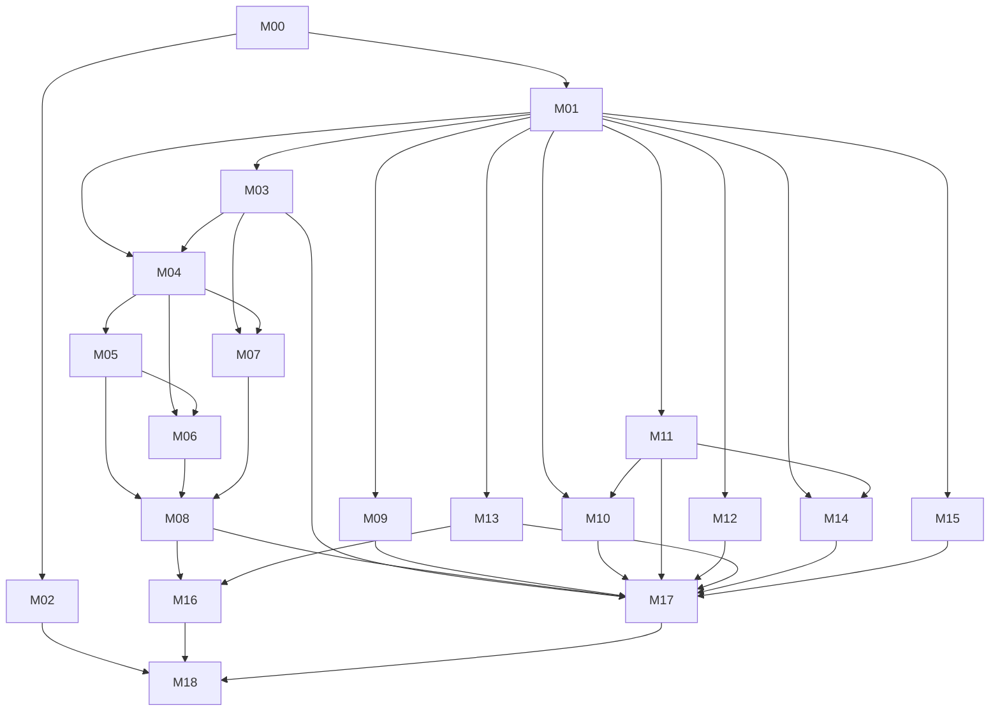

# V8.6 migration execution and coverage ledger

Status: IN PROGRESS / NO ECONOMIC CLAIM. Owner: @ddawnlll. Date: 2026-09-07.

## Preserved source and baseline

The unabridged [V8.6 source](../../contracts/V8_6_PRODUCTION_RECALIBRATION_FULL_TEXT.html) is preserved without edits.
SHA256: c766a472eb9095f87864c4dfeaf898877a06fd47eccdd44e8697c613a6eb01b1.
Its PROVISIONAL status remains unchanged. This plan does not ratify or override higher authority.

Migration parent: e7d80f22888ff1e94f1be882c878f6af801d5375 (#361).
Remote main observed: a5060575ec57e15ceeeaab516c4b4bca0aa7b8b6.
Original dirty local main: c2539cd8ac906132f3d665174c22252183f421db.
Its tracked patch SHA256: 64532f3bc1776f26acaaf63069516fe375512c4d0af948c52f432741b07ae249.
Original worktree and untracked files remain untouched. Snapshot files record actual GitHub metadata.
No PR is merged or closed by this inventory. #361 is retained as parent to preserve its attic work, not because its acceptance is proven.

## Work packages

- [M00: Preserve and reconcile migration baseline](issues/M00.md) — [#358](https://github.com/ddawnlll/v8/issues/358); state:triage.
- [M01: Anchor full V8.6 scope and resolve migration authority](issues/M01.md) — [#353](https://github.com/ddawnlll/v8/issues/353); state:triage.
- [M02: Enforce issue lifecycle and PR requirement traceability](issues/M02.md) — [#370](https://github.com/ddawnlll/v8/issues/370); state:triage.
- [M03: Route baseline through one causal S4 decision path](issues/M03.md) — [#371](https://github.com/ddawnlll/v8/issues/371); state:triage.
- [M04: Define versioned Rust execution boundary](issues/M04.md) — [#367](https://github.com/ddawnlll/v8/issues/367); state:triage.
- [M05: Transfer execution and account lifecycle to NautilusTrader](issues/M05.md) — [#366](https://github.com/ddawnlll/v8/issues/366); state:triage.
- [M06: Bind historical venue facts and fail-closed conformance](issues/M06.md) — [#368](https://github.com/ddawnlll/v8/issues/368); state:triage.
- [M07: Make portfolio admission unavoidable before execution](issues/M07.md) — [#369](https://github.com/ddawnlll/v8/issues/369); state:triage.
- [M08: Reconcile exactly-once engine cashflow independently](issues/M08.md) — [#372](https://github.com/ddawnlll/v8/issues/372); state:triage.
- [M09: Delegate active CLI parsing to clap](issues/M09.md) — [#351](https://github.com/ddawnlll/v8/issues/351); state:triage.
- [M10: Delegate work scheduling to rayon with deterministic merge](issues/M10.md) — [#350](https://github.com/ddawnlll/v8/issues/350); state:triage.
- [M11: Move production random streams to versioned rand primitives](issues/M11.md) — [#373](https://github.com/ddawnlll/v8/issues/373); state:triage.
- [M12: Replace active custom HTML builders with one template engine](issues/M12.md) — [#349](https://github.com/ddawnlll/v8/issues/349); state:triage.
- [M13: Consolidate canonical statistical methods and fix temporal validity](issues/M13.md) — [#348](https://github.com/ddawnlll/v8/issues/348); state:triage.
- [M14: Delegate generic distributions without moving synthetic data into runtime](issues/M14.md) — [#352](https://github.com/ddawnlll/v8/issues/352); state:triage.
- [M15: Verify standard serialization and digest ownership boundaries](issues/M15.md) — [#374](https://github.com/ddawnlll/v8/issues/374); state:triage.
- [M16: Wire one trial-lineage and statistical receipt path](issues/M16.md) — [#354](https://github.com/ddawnlll/v8/issues/354); state:triage.
- [M17: Retire superseded active implementations after acceptance](issues/M17.md) — [#355](https://github.com/ddawnlll/v8/issues/355); state:triage.
- [M18: Verify complete V8.6 acceptance and publish bounded release evidence](issues/M18.md) — [#375](https://github.com/ddawnlll/v8/issues/375); state:triage.

## Dependency graph

Maximum two implementation lanes and one review lane. Shared-file edits are sequential.
All required commodity replacements remain release scope. Deferred rows are explicit below, not silently omitted.
Lifecycle: triage -> ready -> in-progress -> review -> verified closure; blocked is explicit.
Publication of an issue does not satisfy its runtime requirements.

## Complete monograph coverage

| Source | Work package | Obligation |
|---|---|---|
| Document status / abstract | M01 | Draft/non-economic status; no implied ratification |
| §1–2 diagnosis | M00 | Revision-bound evidence, not repeated stale LOC estimates |
| §3 objectives/H1–H6 | M18 | Success/falsification review bound to acceptance |
| §4 doctrine | M01, M17 | Responsibility transfer, retain justified domain semantics |
| §5 architecture | M03, M04, M05 | One coherent causal/execution path |
| §6 substrate | M04, M05 | Pinned process topology and verified API feasibility |
| §7 simulator disposition | M05, M17 | Preserved witnesses; retired authority |
| §8 semantics | M06, M08 | Ambiguity/liquidation honesty |
| §9 canonical universe | M03 | S4 canonical; separate challenger |
| §10 Kaizen | M03, M17 | Offline only; retain hard gates by authority |
| §11 research authority | M13, M16 | Canonical methods, lineage and one receipt |
| §12 infrastructure | M09–M15, M05 | All commodity rows mapped below |
| §13 PIT | M03, M04 | Clocks, prefix invariance, execution eligibility |
| §14 venue | M06 | Historical facts and missing-data gates |
| §15 risk | M07 | V8 policy vs engine primitives; admission token |
| §16 stability | M08, M18 | Mechanical repeatability vs separately evidenced economic stability |
| §17 workflow | M02 | Repository truth, no agent-memory dependency |
| §18 stages A–G | M00, M17, M04, M05, M06, M16, M18 | Stage ordering adjusted by explicit graph; not claimed complete |
| §19 G0–G10 | M18 | Each gate separately verified; no aggregate hides failure |
| §20 falsification | M03, M06, M07, M08, M13, M18 | Temporal/funding/ambiguity/risk/accounting |
| §21 measurements | M10, M12, M17, M18 | Measured timings and ownership; no target masquerades as result |
| §22 decisions | M01 | D-series registration, provisional status |
| §23 layout | M01, M04, M17 | Illustrative tree is not a command to create unnecessary modules |
| §24 anti-goals | ALL | No new platform/Expert/Benchmark/GPU expansion |
| §25 validity threats | M06, M11, M13, M18 | Unresolved limitations disclosed |
| §26 reversal | M00, M05, M17 | Reversible change, no silent engine replacement |
| §27 open questions | M01, M04, M06, M13, M17 | Record explicit pins, do not guess |
| §28 sequence | M00–M18 | Order retained by graph; 24h is not a promised deadline |
| §29 constitution proposal | M01, M18 | Proposal mapped against actual higher authority |
| §30 references | M00, M01 | Historical audit identities preserved |
| Appendix A | M03, M05, M09–M17 | Every subsystem disposition ledger below |
| Appendix B | M18 | Full objective, not a dependency demo |
| Appendix C | M05, M09–M15 | Candidate pins must be verified before installation |

## Appendix A subsystem disposition

| Subsystem | Disposition / owner |
|---|---|
| Experts | KEEP M03; no new families |
| State/features | KEEP + parity burden review M03/M01 |
| Candidate lifecycle | KEEP M03/M04/M07 |
| S4 runloop | canonical M03 |
| V83/opportunity | non-baseline challenger/retire M03/M17 |
| Kaizen runtime overlays | disable baseline M03 |
| Kaizen governance | authority-aware archive M17 |
| Analysis core | KEEP M13 |
| Duplicate helpers | consolidate M13 |
| Evaluation bundles | diagnostic/gate classification M16 |
| Dead evaluation modules | preserve #361 dispositions, verify M00/M17 |
| Qualification | consumer/invariant review M17 |
| EEO/judiciary/assurance | consumer/invariant review M17 |
| TEVV | archive unless current unique requirement M17 |
| usdm_sim | transfer authority M05, legacy M17 |
| Nautilus adapter | thin M04/M05 |
| Venue conformance | M06 |
| Custom scheduler | rayon M10 |
| GPU | FREEZE; no measured workload established |
| HTML reporters | one template engine M12 |
| Canonical identity | KEEP SMALL M15 |
| Digest primitives | delegated, verify M15 |
| CPython shim | frozen reference M11/M17 |
| Production RNG | rand family M11 |
| Benchmark expansion | FREEZE M16/M17 |
| Foundry expansion | FREEZE; test-only generic replacement M14 |

## Commodity migration acceptance

| Responsibility | Package | Counterpart | Acceptance |
|---|---|---|---|
| Execution/accounting | M05 | Nautilus, proposed v1.231.0 | Real engine events, no recreated simulator |
| CLI | M09 | clap, proposed 4.6.6 | Active parser replaced |
| Thread pool | M10 | rayon, proposed 1.12.0 | Active pool replaced; deterministic ordering |
| Narrow SIMD wrapping | M10/M01 | wide, proposed 1.7.0 | Resolve §24 conflict; bit proof before switch |
| RNG/distributions | M11/M14 | rand 0.10.2 / rand_distr 0.6.0 proposed | Algorithm/seed/method version; no false cross-RNG parity |
| HTML | M12 | Askama 0.16.1 proposed; single fallback decision | Active builders removed; escaped template output |
| Generic classical math | M14 | statrs 0.19.1 proposed | Actual matching API; no WRC substitution |
| Serialization | M15 | existing serde/standard formats | Domain schema only retained |
| Digest | M15 | existing sha2/blake3 | Preserve canonical encoding, avoid pointless churn |
| Columnar | M15 | existing Arrow/Parquet | Preserve D-156 physical contracts; expansion DEFER |
| Property/fuzz tests | M02/M18 | proptest/cargo-fuzz/bolero as justified | Mature Rust tooling for meaningful adversarial boundaries |
| GPU/distributed/DB/cache platform | M17 | FREEZE / DO NOT BUILD | No new scope without measured product need |

Version claims in the monograph are **not yet verified by this migration**.
Do not install an unavailable pin or claim a named package supplies an unverified API.
No library swap is complete while the old generic implementation remains on the active production path.

## PR disposition (initial, not final review)

| PR | Observed disposition | Next evidence |
|---|---|---|
| #361 | PRESERVE as migration parent, remains open | Monograph reproducibility, R matrix and retirement review |
| #337 | HOLD / evaluate M00; cargo-profile delta may be reusable | Isolated diff vs current base and actual build-time measurement |
| #338 | HOLD / evaluate M00 | Test discovery equivalence; no lost test witnesses |
| #340 | HOLD / possible M13 primitive optimization | Semantics and allocation/workload proof |
| #341 | HOLD / possible M10 live-path optimization | Confirm retained consumer; avoid legacy engine optimization |
| #339 | HOLD / M10 overlap review | Separate harness, pool and random reduction changes |

No blanket closure. Exact head SHAs and checks: [snapshot](evidence/pr-snapshot.json).
Previous 4/10 -> 8/10 conversation scores are subjective targets, not evidence or release gates.

## Open authority/data pins

1. Existing Constitution/registered parity and Kaizen reachability vs provisional V8.6 retirement: M01.
2. Appendix C narrow SIMD wrap vs §24 platform freeze: M01/M10.
3. RNG algorithm transition vs historical CPython bit identity: M01/M11.
4. Rust-only application + Nautilus separate-process/file topology feasibility: M04/M05.
5. Historical mark/funding/bracket/account-mode provenance: M06.
6. Registered estimators, trial family and authority receipt: M13/M16.
7. Existing D-152/D-153 G7–G9 identities must not be silently redefined by V8.6 G0–G10: M01/M16.

Only dependent implementation stops on a pin. Mechanical CLI/template work can proceed once its own requirements are ready.
No lifecycle label or PASS receipt is fabricated to bypass these boundaries.
